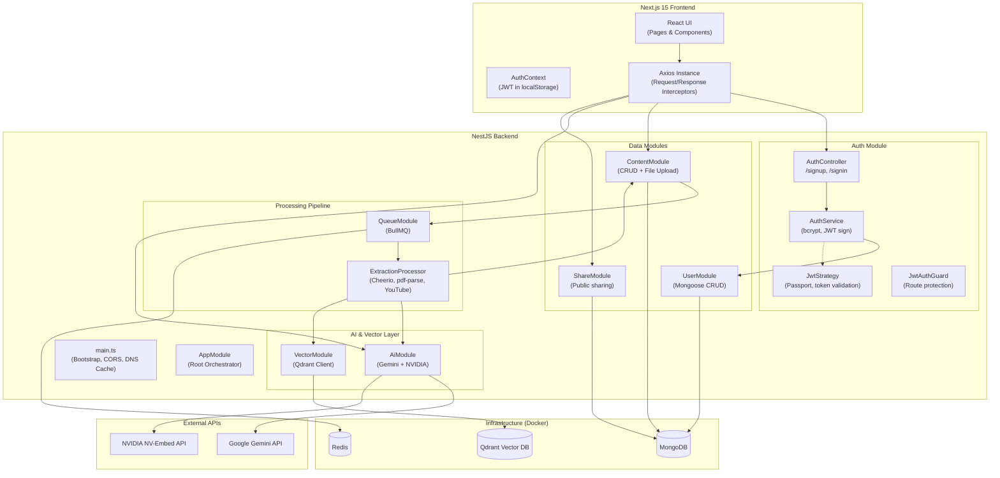
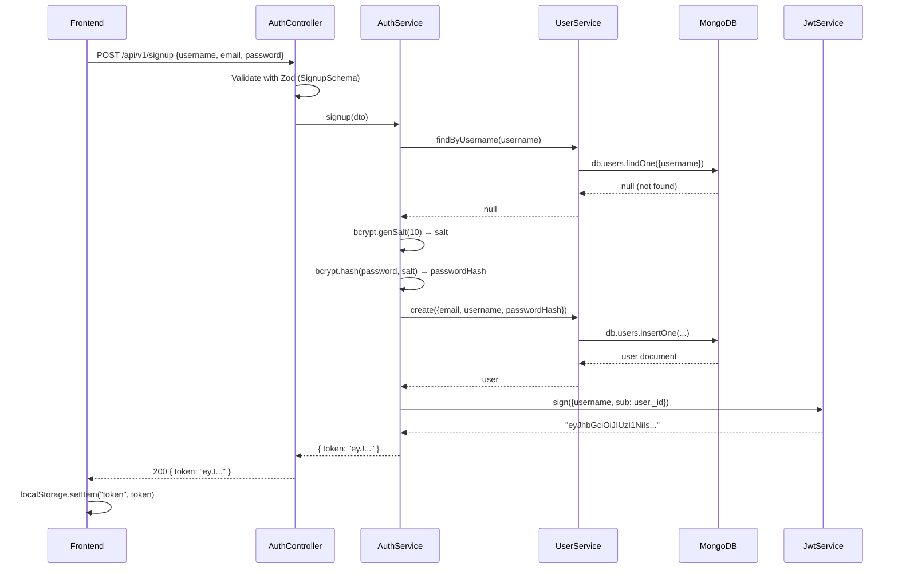
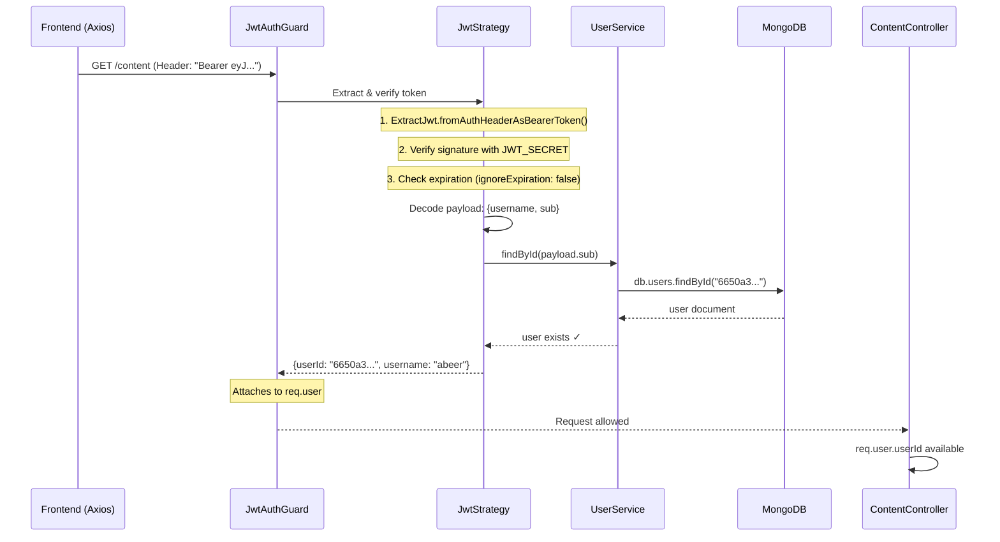
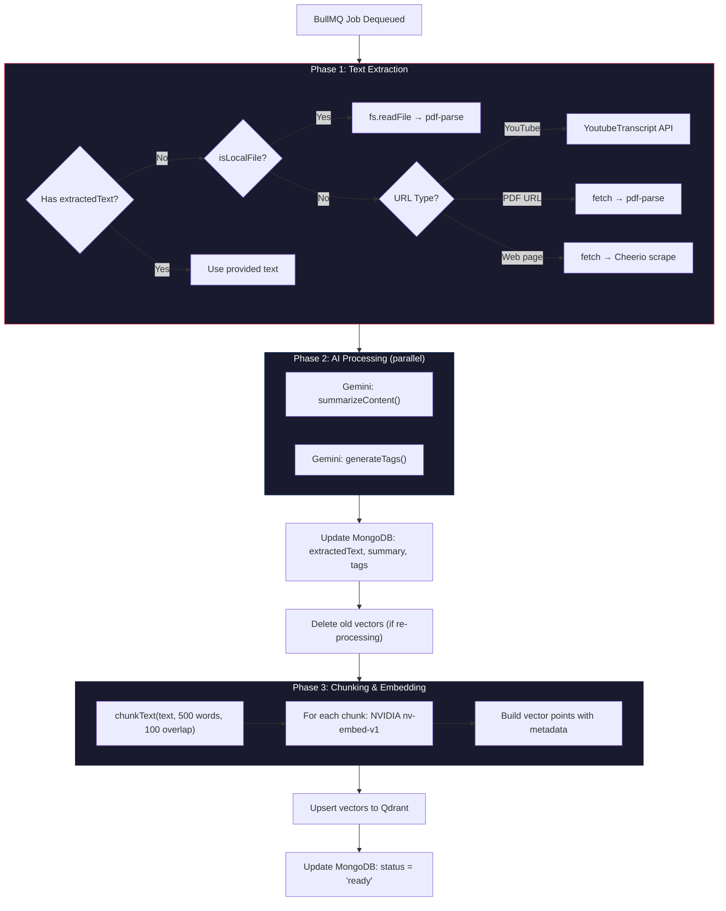
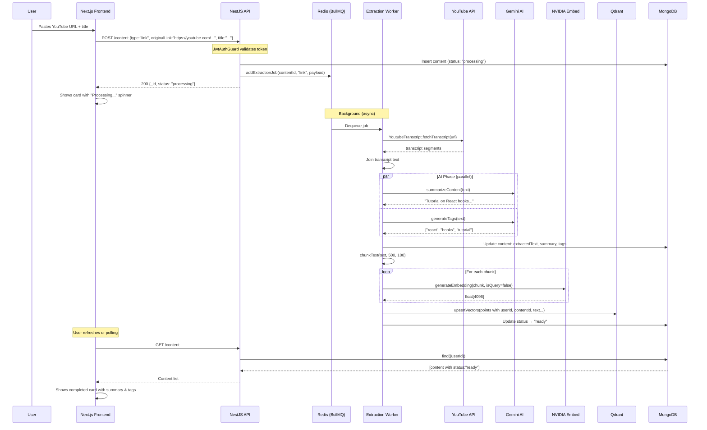
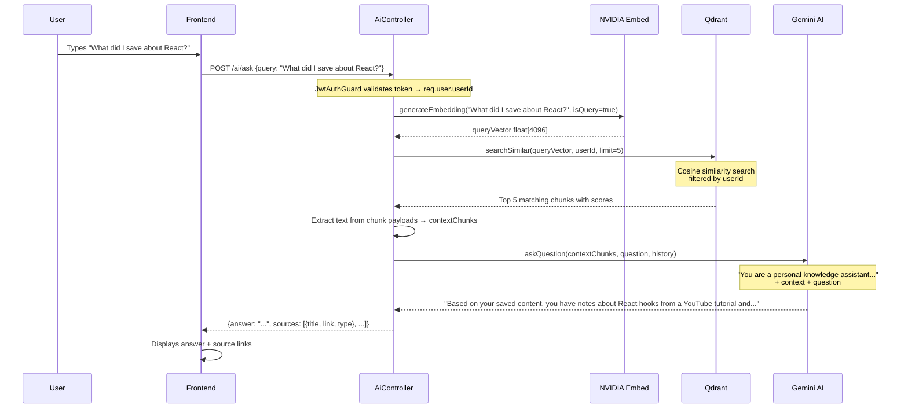
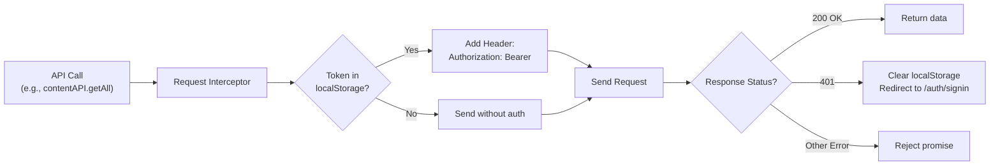
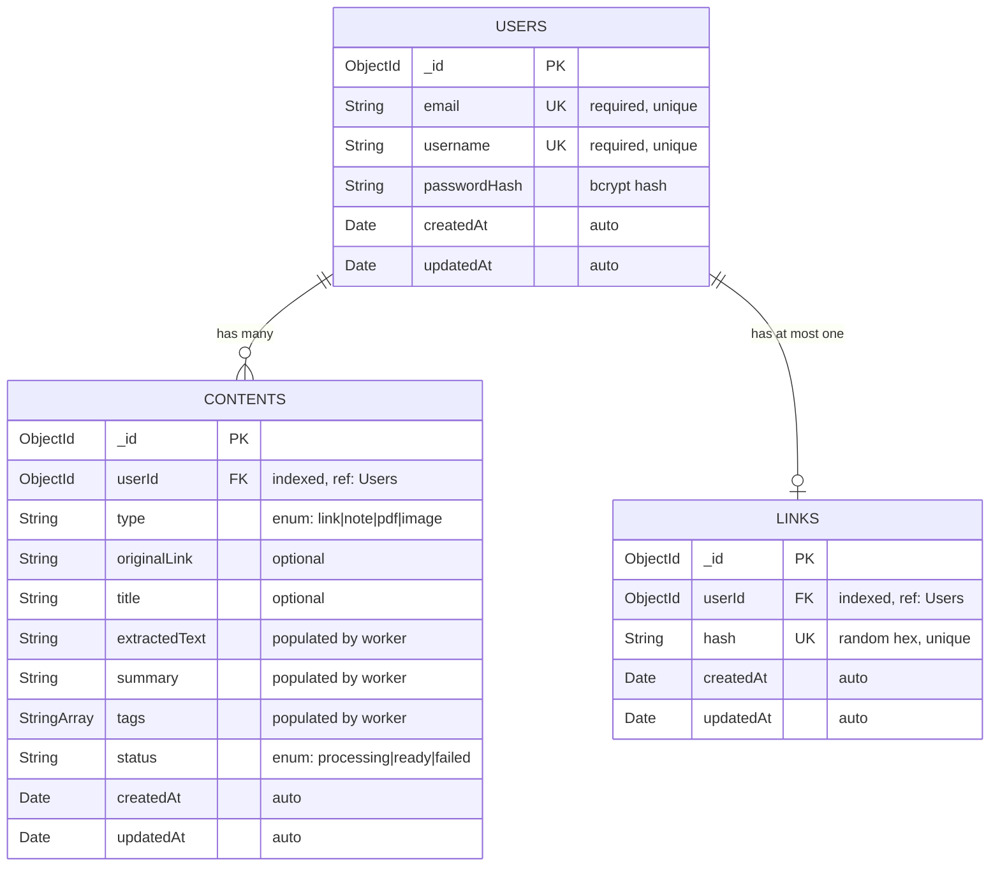
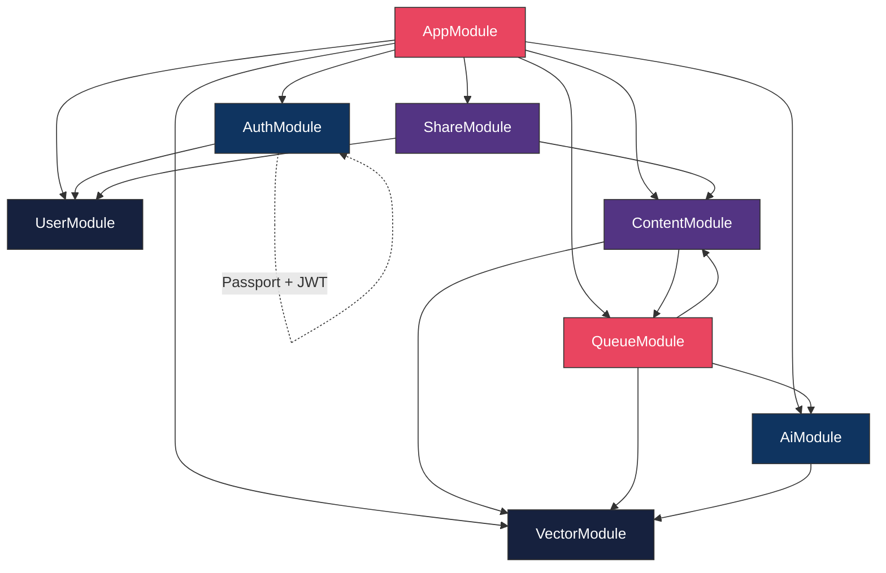

# 🧠 SuperBrain — Deep Architecture & Data Flow Walkthrough

SuperBrain is an AI-powered personal knowledge vault. You save links, PDFs, images, and notes; the system extracts text, generates embeddings and summaries asynchronously, stores them in a vector database, and lets you ask natural-language questions over your personal data using RAG (Retrieval-Augmented Generation).

---

## 1. High-Level System Architecture



---

## 2. Application Bootstrap — [main.ts](file:///home/abeer/Desktop/2ndBrain/super-brain-be/src/main.ts)

This is the entry point. It does three important things before starting the NestJS app:

### 2.1 DNS Caching for Qdrant Cloud
Lines 5–50 implement a **DNS monkey-patch** that resolves the Qdrant Cloud hostname once at startup and caches the IP address. This is a performance optimization — every HTTP request to Qdrant would otherwise trigger a DNS lookup. The patch intercepts Node's `dns.lookup()` and returns the cached IP for the Qdrant hostname.

### 2.2 Global Prefix
```typescript
app.setGlobalPrefix('api/v1');
```
All routes are prefixed with `/api/v1/`. So `@Controller('content')` maps to `GET /api/v1/content`.

### 2.3 CORS
```typescript
app.enableCors({
  origin: (origin, callback) => callback(null, true), // Allow ALL origins
  credentials: true,
});
```
Currently allows all origins — suitable for development but should be locked down in production.

---

## 3. Root Module — [app.module.ts](file:///home/abeer/Desktop/2ndBrain/super-brain-be/src/app.module.ts)

The `AppModule` is the composition root that wires everything together:

| Import | Purpose |
|---|---|
| `ConfigModule.forRoot({ isGlobal: true })` | Reads `.env` and makes `ConfigService` injectable globally |
| `MongooseModule.forRootAsync(...)` | Connects to MongoDB using `MONGO_URL` env var |
| `BullModule.forRootAsync(...)` | Connects BullMQ to Redis (supports `REDIS_URL` or individual `REDIS_HOST`/`REDIS_PORT`/`REDIS_PASSWORD`). Auto-detects Upstash TLS. |
| `AuthModule` | User authentication |
| `UserModule` | User data access |
| `ContentModule` | Content CRUD |
| `AiModule` | Gemini LLM + NVIDIA embeddings |
| `VectorModule` | Qdrant vector DB operations |
| `QueueModule` | Background job processing |
| `ShareModule` | Public brain sharing |

> [!IMPORTANT]
> The `ConfigModule` is `isGlobal: true`, meaning `ConfigService` can be injected in any module without re-importing `ConfigModule`. This is why you see `ConfigService` used directly in `JwtStrategy`, `VectorService`, and `AiService`.

---

## 4. Authentication — The JWT Flow in Detail

This is the most important security mechanism in the app. Here's exactly how it works end-to-end:

### 4.1 The Pieces

| File | Role |
|---|---|
| [auth.dto.ts](file:///home/abeer/Desktop/2ndBrain/super-brain-be/src/auth/dto/auth.dto.ts) | Zod schemas for request validation |
| [auth.controller.ts](file:///home/abeer/Desktop/2ndBrain/super-brain-be/src/auth/auth.controller.ts) | HTTP endpoints for `/signup` and `/signin` |
| [auth.service.ts](file:///home/abeer/Desktop/2ndBrain/super-brain-be/src/auth/auth.service.ts) | Business logic: hash passwords, verify credentials, sign tokens |
| [jwt.strategy.ts](file:///home/abeer/Desktop/2ndBrain/super-brain-be/src/auth/strategies/jwt.strategy.ts) | Passport strategy: validates incoming tokens |
| [jwt-auth.guard.ts](file:///home/abeer/Desktop/2ndBrain/super-brain-be/src/auth/guards/jwt-auth.guard.ts) | NestJS guard: protects routes |
| [auth.module.ts](file:///home/abeer/Desktop/2ndBrain/super-brain-be/src/auth/auth.module.ts) | Wires everything: Passport, JWT config, providers |

### 4.2 Signup Flow



**Key details:**
- **Password hashing**: Uses `bcrypt` with a salt round of 10. The plaintext password is **never stored** — only `passwordHash`.
- **JWT payload**: `{ username: "abeer", sub: "6650a3..." }` — `sub` (subject) is the MongoDB `_id`.
- **Token expiry**: `1d` (24 hours), configured in [auth.module.ts](file:///home/abeer/Desktop/2ndBrain/super-brain-be/src/auth/auth.module.ts#L18).
- **JWT secret**: Read from `JWT_SECRET` env var, defaults to `'supersecret'`.

### 4.3 Signin Flow

Same as signup except:
1. Looks up the user by username
2. Compares the submitted password against the stored `passwordHash` using `bcrypt.compare()`
3. If mismatch → throws `UnauthorizedException('Invalid credentials')`
4. If match → signs and returns a new JWT

### 4.4 How Protected Routes Work (Token Validation)

When a request hits a protected endpoint (e.g., `GET /api/v1/content`), here's exactly what happens:



**The three-layer defense:**
1. **`JwtAuthGuard`** ([jwt-auth.guard.ts](file:///home/abeer/Desktop/2ndBrain/super-brain-be/src/auth/guards/jwt-auth.guard.ts)) — extends Passport's `AuthGuard('jwt')`. Simply activates the JWT strategy.
2. **`JwtStrategy`** ([jwt.strategy.ts](file:///home/abeer/Desktop/2ndBrain/super-brain-be/src/auth/strategies/jwt.strategy.ts)) — does the actual work:
   - Extracts the token from `Authorization: Bearer <token>`
   - Verifies the token's HMAC signature using `JWT_SECRET`
   - Checks the token hasn't expired
   - Calls `validate()` which does a **database lookup** to ensure the user still exists
   - Returns `{ userId, username }` which gets attached to `req.user`
3. **Controller-level `@UseGuards(JwtAuthGuard)`** — applied to each controller or method that needs protection

### 4.5 Frontend Token Management

On the frontend side ([AuthContext.tsx](file:///home/abeer/Desktop/2ndBrain/super-brain-fe/contexts/AuthContext.tsx) + [api.ts](file:///home/abeer/Desktop/2ndBrain/super-brain-fe/lib/api.ts)):

1. **After login/signup**: Token is stored in `localStorage.setItem("token", token)`
2. **On every API call**: An Axios **request interceptor** reads the token and adds it:
   ```typescript
   config.headers.Authorization = `Bearer ${token}`;
   ```
3. **On 401 response**: An Axios **response interceptor** auto-clears the token and redirects to `/auth/signin`
4. **On page load**: `AuthContext` checks `localStorage` for an existing token/user to restore the session

> [!WARNING]
> The JWT secret defaults to `'supersecret'` if `JWT_SECRET` is not set. This is a critical security risk in production — always set a strong, unique secret via environment variables.

---

## 5. Module-by-Module Breakdown

### 5.1 User Module — The Data Foundation

| File | Purpose |
|---|---|
| [user.schema.ts](file:///home/abeer/Desktop/2ndBrain/super-brain-be/src/user/schemas/user.schema.ts) | Mongoose schema: `email` (unique), `username` (unique), `passwordHash` |
| [user.service.ts](file:///home/abeer/Desktop/2ndBrain/super-brain-be/src/user/user.service.ts) | Three methods: `create()`, `findByUsername()`, `findById()` |
| [user.module.ts](file:///home/abeer/Desktop/2ndBrain/super-brain-be/src/user/user.module.ts) | Registers schema, exports `UserService` |

**Significance**: This is the foundational module. Both `AuthModule` (for signup/signin) and `ShareModule` (to resolve usernames for shared brains) depend on it. The `exports: [UserService]` is critical — it makes `UserService` injectable in other modules that import `UserModule`.

### 5.2 Content Module — The Core Data Manager

| File | Purpose |
|---|---|
| [content.schema.ts](file:///home/abeer/Desktop/2ndBrain/super-brain-be/src/content/schemas/content.schema.ts) | Mongoose schema with `userId`, `type`, `originalLink`, `title`, `extractedText`, `summary`, `tags`, `status` |
| [content.dto.ts](file:///home/abeer/Desktop/2ndBrain/super-brain-be/src/content/dto/content.dto.ts) | Zod validation: type must be `link | note | pdf | image` |
| [content.service.ts](file:///home/abeer/Desktop/2ndBrain/super-brain-be/src/content/content.service.ts) | CRUD: `create()`, `findByUser()`, `findById()`, `updateStatus()`, `delete()` |
| [content.controller.ts](file:///home/abeer/Desktop/2ndBrain/super-brain-be/src/content/content.controller.ts) | Protected endpoints: `POST /content`, `POST /content/upload`, `GET /content`, `DELETE /content/:id` |
| [content.module.ts](file:///home/abeer/Desktop/2ndBrain/super-brain-be/src/content/content.module.ts) | Registers Multer for file uploads (disk storage, 10MB limit) |

**Significance**: This is the hub of the application. Every piece of knowledge flows through here. The content lifecycle is:
1. **Created** with `status: 'processing'`
2. **Queued** for background extraction
3. **Updated** to `status: 'ready'` or `status: 'failed'` by the processor

> [!NOTE]
> The `forwardRef(() => QueueModule)` in [content.module.ts](file:///home/abeer/Desktop/2ndBrain/super-brain-be/src/content/content.module.ts#L15) resolves a **circular dependency**: `ContentModule` imports `QueueModule` (to enqueue jobs), and `QueueModule` imports `ContentModule` (to update content status from the processor). `forwardRef` tells NestJS to lazily resolve the dependency.

### 5.3 Queue Module — The Async Engine

| File | Purpose |
|---|---|
| [queue.module.ts](file:///home/abeer/Desktop/2ndBrain/super-brain-be/src/queue/queue.module.ts) | Registers BullMQ queue named `'extraction'` |
| [queue.service.ts](file:///home/abeer/Desktop/2ndBrain/super-brain-be/src/queue/queue.service.ts) | `addExtractionJob()` — enqueues with 3 retries, exponential backoff (5s base) |
| [extraction.processor.ts](file:///home/abeer/Desktop/2ndBrain/super-brain-be/src/queue/processors/extraction.processor.ts) | The **worker** that processes queued jobs |

**Significance**: This decouples the user-facing API from the heavy processing. When a user adds content, the API responds immediately with `status: 'processing'`, while the actual extraction + embedding happens in the background.

**Job configuration:**
```typescript
{
  attempts: 3,              // Retry up to 3 times
  backoff: {
    type: 'exponential',
    delay: 5000,            // 5s → 10s → 20s between retries
  },
  removeOnComplete: 100,    // Keep last 100 completed jobs
  removeOnFail: 500,        // Keep last 500 failed jobs
}
```

### 5.4 Extraction Processor — The Processing Pipeline

This is the most complex single file in the project. Here's the full pipeline:



**Content extraction methods:**

| Source | Library | Method |
|---|---|---|
| Web page | `cheerio` | Fetches HTML, removes `<script>` and `<style>` tags, extracts body text |
| PDF (URL) | `pdf-parse` | Fetches as ArrayBuffer, parses with pdf-parse |
| PDF (local file) | `pdf-parse` | Reads from disk via `fs.readFile` |
| YouTube | `youtube-transcript` | Uses the unofficial YouTube Transcript API; falls back to Cheerio scraping |
| Image (local) | — | Placeholder, OCR not yet implemented |

### 5.5 AI Module — The Intelligence Layer

| File | Purpose |
|---|---|
| [ai.module.ts](file:///home/abeer/Desktop/2ndBrain/super-brain-be/src/ai/ai.module.ts) | Imports `VectorModule`, exports `AiService` |
| [ai.service.ts](file:///home/abeer/Desktop/2ndBrain/super-brain-be/src/ai/ai.service.ts) | Core AI logic: embeddings, summarization, tagging, RAG Q&A |
| [ai.controller.ts](file:///home/abeer/Desktop/2ndBrain/super-brain-be/src/ai/ai.controller.ts) | Protected endpoints: `GET /ai/search`, `POST /ai/ask` |

**AiService provides 5 capabilities:**

#### 1. `generateEmbedding(text, isQuery)` — NVIDIA NV-Embed-v1
Calls `https://integrate.api.nvidia.com/v1/embeddings` with the `nvidia/nv-embed-v1` model. Returns a **4096-dimensional** float vector. The `input_type` flag (`'query'` vs `'passage'`) is important — it tells the model whether the text is a search query or a document passage, which affects the embedding quality.

#### 2. `summarizeContent(text)` — Gemini Flash Lite
Uses `gemini-flash-lite-latest` to generate a 1-2 sentence summary (≤200 chars). The prompt instructs it to skip meta-commentary and start directly with the substance.

#### 3. `generateTags(text)` — Gemini Flash Lite
Generates 3-5 lowercase tags. The response is parsed by splitting on commas.

#### 4. `askQuestion(context, question, history)` — Gemini Flash Lite (RAG)
The core RAG function. Receives pre-retrieved context chunks and conversation history, constructs a prompt, and generates an answer grounded in the user's own data.

#### 5. `chunkText(text, 500, 100)` — Text Chunking
Splits text into overlapping windows of 500 words with 100-word overlap. The overlap ensures that information at chunk boundaries isn't lost during retrieval.

**Rate limiting**: The `runWithRetry()` method handles Gemini's 429 (rate limit) responses with exponential backoff up to 5 retries. It even parses the `retryDelay` from Google's error response for optimal wait times.

### 5.6 Vector Module — The Semantic Memory

| File | Purpose |
|---|---|
| [vector.module.ts](file:///home/abeer/Desktop/2ndBrain/super-brain-be/src/vector/vector.module.ts) | Simple module: provides & exports `VectorService` |
| [vector.service.ts](file:///home/abeer/Desktop/2ndBrain/super-brain-be/src/vector/vector.service.ts) | Qdrant client wrapper with lifecycle management |

**Key operations:**

| Method | What it does |
|---|---|
| `onModuleInit()` | On startup: checks if the `secondbrain` collection exists, creates it if not (4096 dimensions, Cosine distance). Ensures payload indexes on `userId` and `contentId`. |
| `upsertVectors()` | Inserts/updates vector points with metadata (`contentId`, `userId`, `text`, `title`, `link`, `type`) |
| `searchSimilar()` | Searches for the top-N most similar vectors, **filtered by `userId`** so users only search their own data |
| `deleteByContentId()` | Removes all vectors associated with a content ID (used on content deletion or re-processing) |

> [!IMPORTANT]
> The `userId` filter in `searchSimilar()` is the **data isolation boundary**. Without it, users could retrieve each other's content through semantic search. This filter uses a Qdrant payload index for efficient filtering.

### 5.7 Share Module — Public Brain Sharing

| File | Purpose |
|---|---|
| [link.schema.ts](file:///home/abeer/Desktop/2ndBrain/super-brain-be/src/share/schemas/link.schema.ts) | Mongoose schema: `userId` (ObjectId ref) + `hash` (unique string) |
| [share.service.ts](file:///home/abeer/Desktop/2ndBrain/super-brain-be/src/share/share.service.ts) | Creates/disables share links, resolves hash → userId |
| [share.controller.ts](file:///home/abeer/Desktop/2ndBrain/super-brain-be/src/share/share.controller.ts) | `POST /brain/share` (protected), `GET /brain/:shareLink` (public) |

**How sharing works:**
1. User calls `POST /brain/share { share: true }` (authenticated)
2. Service generates a random 20-character hex hash (`crypto.randomBytes(10).toString('hex')`)
3. Stores `{ userId, hash }` in MongoDB
4. Returns the hash to the frontend
5. Frontend constructs the full URL: `https://yourdomain.com/share/<hash>`
6. **Anyone** can call `GET /brain/<hash>` (no auth required) to view the user's content
7. To disable: `POST /brain/share { share: false }` deletes the link document

> [!NOTE]
> The `GET /brain/:shareLink` endpoint has **no `@UseGuards(JwtAuthGuard)`** — this is intentional. It's the only content endpoint accessible without authentication, enabling public sharing.

---

## 6. End-to-End Data Flow Scenarios

### 6.1 User Saves a YouTube Link



### 6.2 User Asks "What did I save about React?"



---

## 7. Frontend Architecture

### 7.1 Key Files

| File | Role |
|---|---|
| [api.ts](file:///home/abeer/Desktop/2ndBrain/super-brain-fe/lib/api.ts) | Axios instance + interceptors + all API functions |
| [AuthContext.tsx](file:///home/abeer/Desktop/2ndBrain/super-brain-fe/contexts/AuthContext.tsx) | React Context for auth state, wraps the entire app |
| [ProtectedRoute.tsx](file:///home/abeer/Desktop/2ndBrain/super-brain-fe/components/ProtectedRoute.tsx) | HOC that redirects unauthenticated users |
| [useContent.ts](file:///home/abeer/Desktop/2ndBrain/super-brain-fe/hooks/useContent.ts) | Hook for content CRUD with local state management |
| [useSearch.ts](file:///home/abeer/Desktop/2ndBrain/super-brain-fe/hooks/useSearch.ts) | Hook for semantic search with query persistence |
| [useShareBrain.ts](file:///home/abeer/Desktop/2ndBrain/super-brain-fe/hooks/useShareBrain.ts) | Hook for toggling share state |

### 7.2 Axios Interceptor Flow



This is a **stateless authentication** model — the server doesn't maintain sessions. Each request carries its own proof of identity (the JWT), and the server validates it from scratch every time.

---

## 8. Database Schemas

### MongoDB Collections



### Qdrant Collection: `secondbrain`

| Field | Type | Description |
|---|---|---|
| `id` | UUID | Unique vector point ID |
| `vector` | float[4096] | NVIDIA nv-embed-v1 embedding |
| `payload.contentId` | keyword (indexed) | Links back to MongoDB Content |
| `payload.userId` | keyword (indexed) | For per-user data isolation |
| `payload.text` | string | The original text chunk |
| `payload.title` | string | Content title |
| `payload.link` | string | Original source URL |
| `payload.type` | string | Content type |

---

## 9. Module Dependency Graph



> [!NOTE]
> The bidirectional arrow between `Content ↔ Queue` is the circular dependency resolved with `forwardRef()`. Content needs Queue to enqueue jobs; Queue's processor needs Content to update status.

---

## 10. Security Summary

| Mechanism | Implementation | Where |
|---|---|---|
| Password hashing | bcrypt (10 salt rounds) | [auth.service.ts](file:///home/abeer/Desktop/2ndBrain/super-brain-be/src/auth/auth.service.ts#L20-L21) |
| Token signing | HMAC-SHA256 (HS256) | [auth.module.ts](file:///home/abeer/Desktop/2ndBrain/super-brain-be/src/auth/auth.module.ts#L14-L21) |
| Token validation | Passport JWT Strategy | [jwt.strategy.ts](file:///home/abeer/Desktop/2ndBrain/super-brain-be/src/auth/strategies/jwt.strategy.ts) |
| Route protection | `@UseGuards(JwtAuthGuard)` | Content, AI, Share (POST) controllers |
| Input validation | Zod schemas (`safeParse`) | Auth DTOs, Content DTOs |
| Data isolation | Qdrant `userId` filter | [vector.service.ts](file:///home/abeer/Desktop/2ndBrain/super-brain-be/src/vector/vector.service.ts#L101-L116) |
| MongoDB data isolation | `find({ userId })` | [content.service.ts](file:///home/abeer/Desktop/2ndBrain/super-brain-be/src/content/content.service.ts#L16) |
| File upload limits | Multer 10MB max | [content.controller.ts](file:///home/abeer/Desktop/2ndBrain/super-brain-be/src/content/content.controller.ts#L41) |
| Auto-logout on 401 | Axios response interceptor | [api.ts](file:///home/abeer/Desktop/2ndBrain/super-brain-fe/lib/api.ts#L37-L50) |
