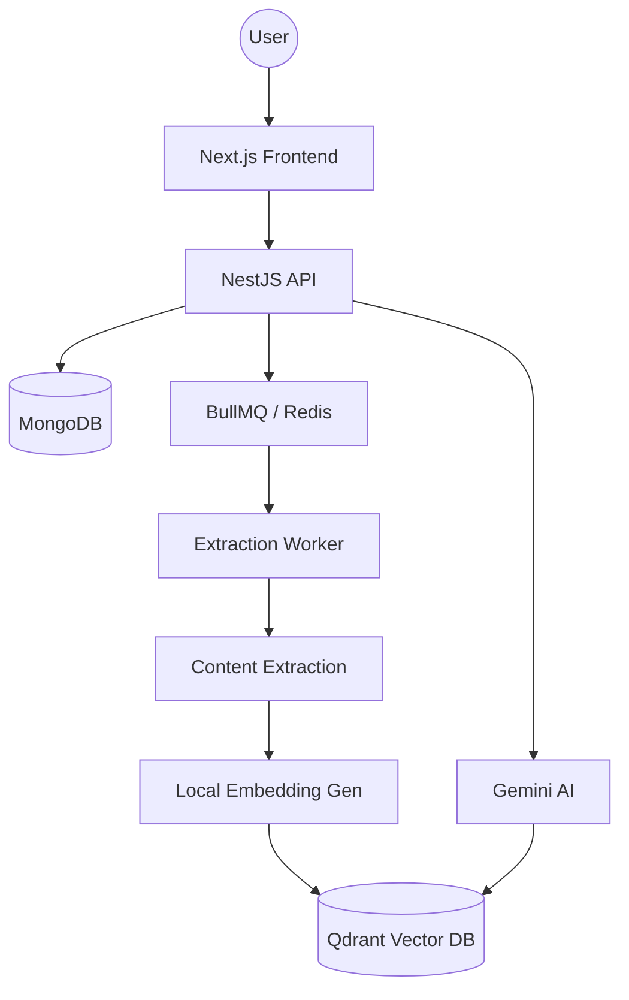

# 🧠 SuperBrain: Your AI-Powered Personal Knowledge Vault

SuperBrain is a production-grade, AI-native "Second Brain" application designed to help you capture, organize, and query everything you consume online. It automatically extracts content from links (YouTube, Twitter, Blogs), PDFs, and images, stores them in a vector database, and allows you to ask questions over your data using RAG (Retrieval-Augmented Generation).

---

## 🚀 Key Features

- **Multi-Source Ingestion**: Support for YouTube transcripts, Twitter threads, Web articles, PDFs, and Images (OCR).
- **AI-Powered Extraction**: Automatic text extraction and cleaning using Cheerio, PDF-parse, and Tesseract.
- **Semantic Search**: Natural language search powered by vector embeddings (`all-MiniLM-L6-v2`).
- **"Ask Your Brain"**: A RAG-based chat interface using **Google Gemini** to answer questions grounded in your saved content.
- **Public Sharing**: Share specific curated "brains" or folders via unique public links.
- **Asynchronous Processing**: High-performance background job processing using **BullMQ** and **Redis**.
- **100% Free Stack**: Architected to run entirely on free-tier services (MongoDB Atlas, Upstash Redis, Qdrant Cloud, Gemini Free API).

---

## 🛠 Tech Stack

### Frontend
- **Framework**: Next.js 15 (App Router)
- **Styling**: TailwindCSS + Lucide Icons
- **Animations**: Framer Motion
- **API Client**: Axios with Interceptors

### Backend
- **Framework**: NestJS (TypeScript)
- **Database**: MongoDB (Mongoose)
- **Vector DB**: Qdrant
- **Queue System**: BullMQ + Redis
- **Authentication**: Passport.js + JWT

### AI Layer
- **LLM**: Google Generative AI (Gemini Flash)
- **Embeddings**: Local CPU-based embeddings (`@xenova/transformers`)
- **OCR**: Tesseract.js

---

## 🏗 System Architecture



---

## ⚙️ Environment Variables

### Backend (`super-brain-be/.env`)
```env
PORT=3000
MONGO_URL=your_mongodb_atlas_uri
REDIS_HOST=your_redis_host
REDIS_PORT=your_redis_port
REDIS_PASSWORD=your_redis_password
JWT_SECRET=your_jwt_secret
GEMINI_API_KEY=your_google_gemini_api_key
QDRANT_URL=your_qdrant_cloud_url
QDRANT_API_KEY=your_qdrant_api_key
```

### Frontend (`super-brain-fe/.env.local`)
```env
NEXT_PUBLIC_API_URL=https://your-backend-url.com/api/v1
```

---

## 🏃‍♂️ Getting Started

### 1. Prerequisites
- Node.js v20+
- MongoDB instance (Local or Atlas)
- Redis instance (Local or Upstash)
- Qdrant instance (Local or Cloud)

### 2. Backend Setup
```bash
cd super-brain-be
npm install
npm run start:dev
```

### 3. Frontend Setup
```bash
cd super-brain-fe
npm install
npm run dev
```

---

## 📜 License

Distributed under the MIT License. See `LICENSE` for more information.

---

## 🤝 Contributing

1. Fork the Project
2. Create your Feature Branch (`git checkout -b feature/AmazingFeature`)
3. Commit your Changes (`git commit -m 'Add some AmazingFeature'`)
4. Push to the Branch (`git push origin feature/AmazingFeature`)
5. Open a Pull Request
